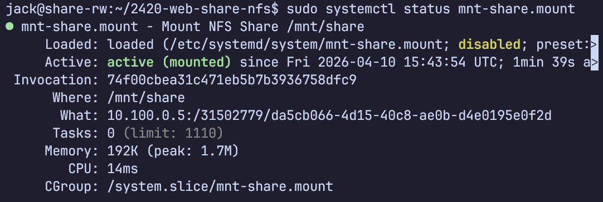
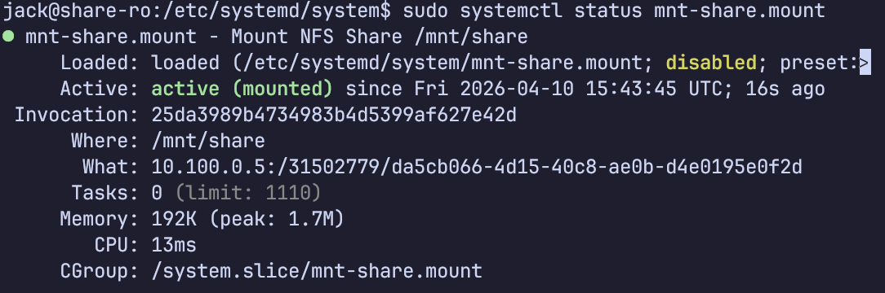
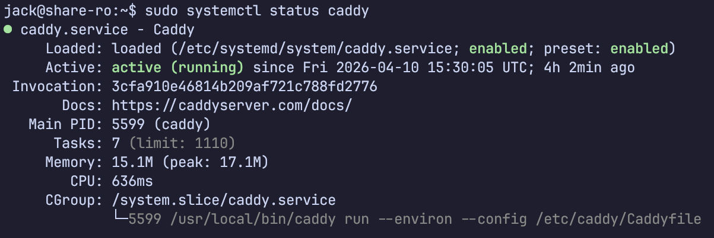
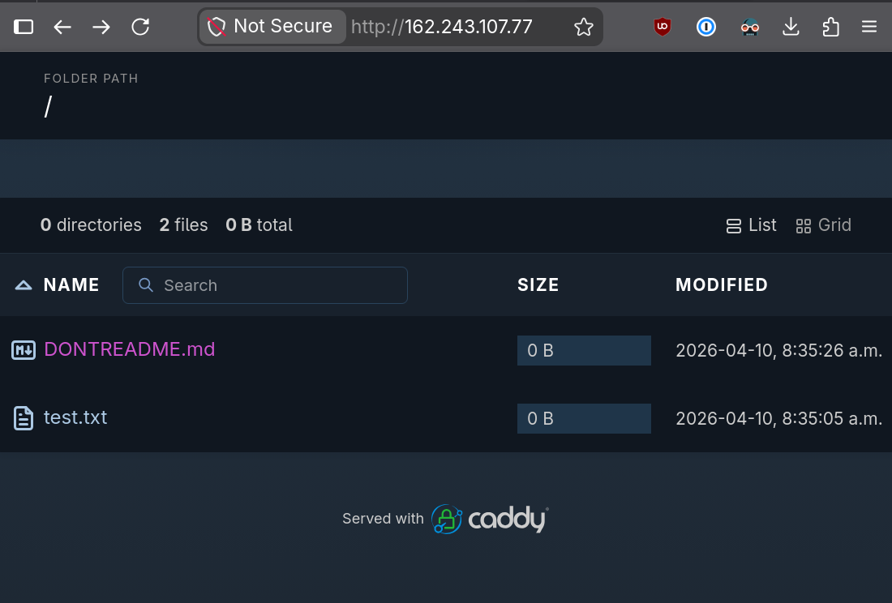

# `cloud-config.yaml` File
```yaml
#cloud-config
# You will need to edit this file before creating your new servers
users:
  - name: jack
    primary_group: jack
    groups: sudo
    shell: /bin/bash
    sudo: ['ALL=(ALL) NOPASSWD:ALL']
    ssh-authorized-keys:
      - ssh-ed25519 AAAAC3NzaC1lZDI1NTE5AAAAICRuPzxZC7VsP/+CxphY+u5qKFSJ61FyGa6y7ih3WdH7 DigitalOcean

write_files:
  - owner: root:root
    path: /etc/caddy/Caddyfile
    content: |
      :80 {
        root * /mnt/share
        file_server browse
      }

package_update: true
package_upgrade: true

packages:
  - ripgrep
  - rsync
  - git
  - nfs-common

disable_root: true

runcmd:
  - sed -i -e '/^PermitRootLogin/s/^.*$/PermitRootLogin no/' /etc/ssh/sshd_config
  - systemctl restart ssh
  - useradd -rmd /home/caddy -s /usr/sbin/nologin caddy
  - mkdir -p /mnt/share
```

# Mount file
```ini
[Unit]
Description=Mount NFS Share /mnt/share
After=network-online.target
Wants=network-online.target

[Mount]
What=10.100.0.5:/31502779/da5cb066-4d15-40c8-ae0b-d4e0195e0f2d
Where=/mnt/share
Type=nfs
Options=nconnect=8,ro
TimeoutSec=30

[Install]
WantedBy=multi-user.target
```

# Droplet Web Console Screenshot


# NFS Web Console Screenshot


# `systemctl` Status Screenshots






# Caddy File Server Screenshot
